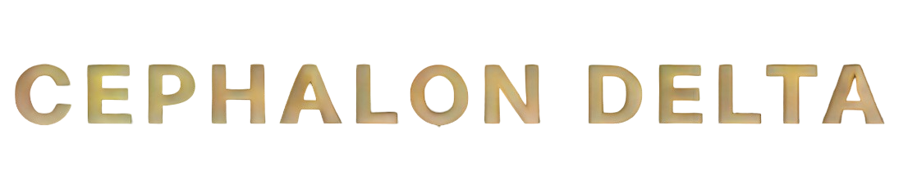
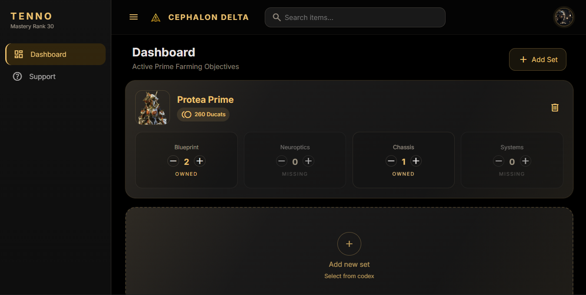
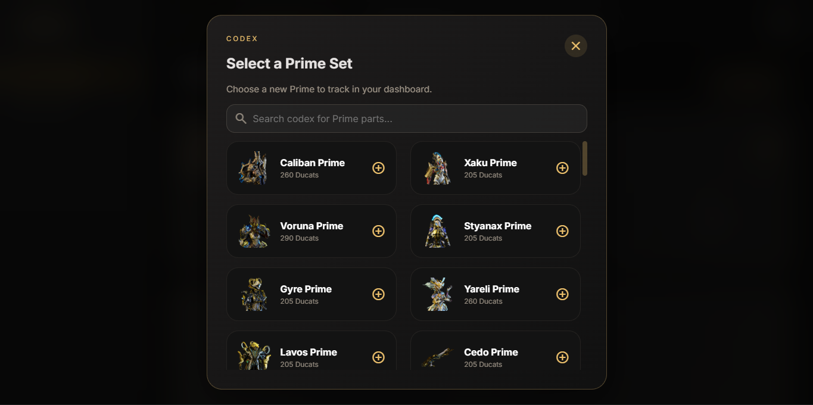

<p align="center">
  
</p>

<p align="center">
A clean, open-source Prime Inventory Tracker for Warframe players.<br>
Built with Flask as a personal learning project and gradually evolving into a complete companion application.
</p>

<p align="center">


</p>

---

# About

Cephalon Delta is an inventory management application designed for **Warframe** players.

Rather than replacing community tools such as Warframe Market, Cephalon Delta focuses on helping players organize and visualize their Prime collection through a clean dashboard.

The system allows players to:

- Track owned Prime items
- Monitor collected Prime parts
- Detect completed Prime sets
- View Ducat values
- Organize farming progress
- Prepare inventories for Baro Ki'Teer

The project started as a personal challenge to learn Flask, SQLAlchemy and software architecture while building something genuinely useful for a game I enjoy.

Today it serves both as my main programming project and the inventory manager I personally use while playing Warframe.

---

# The Story Behind Cephalon Delta

Cephalon Delta began as a very simple CRUD application.

Its original purpose was never to become a public project, it was simply a way to learn backend development by building something I actually wanted to use.

Instead of following tutorials, the application was rebuilt several times as my understanding of databases, object relationships, migrations and application architecture evolved.

Every refactor represented another step in learning concepts such as:

- SQLAlchemy relationships
- Foreign Keys
- Cascades
- Alembic migrations
- MVC architecture
- Service Layer pattern
- Database normalization

Although it started purely as an educational project, it eventually became a fully functional Prime inventory manager.

Today, Cephalon Delta represents both my learning journey and a tool I actively use while playing Warframe.

---

# Why Cephalon Delta?

Most Warframe companion applications focus on trading.

Cephalon Delta focuses on **collecting**.

The philosophy behind the project is simple:

> **Track your collection first. Selling comes later.**

Instead of relying on spreadsheets or manually checking missing parts, players can manage their entire Prime inventory from a single dashboard.

---

# Features

## Current Features

- Prime inventory management
- Automatic inventory generation
- Individual Prime part tracking
- Dynamic Prime artwork
- Automatic Ducat synchronization using the Warframe Market API
- Responsive dashboard
- SQLite database
- SQLAlchemy ORM
- Flask backend
- Service-oriented architecture
- Alembic migrations

---

# Screenshots

## Dashboard



```
docs/images/dashboard.png
```

---

## Add Prime Set



```
docs/images/modal.png
```

---

# Tech Stack

## Backend

- Python
- Flask
- SQLAlchemy

## Database

- SQLite

## Frontend

- HTML
- CSS
- JavaScript

## Architecture

- MVC
- Service Layer

---

# Project Structure

```text
Cephalon-Delta/

│
├── controllers/
│
├── docs/
│
├── instance/
│
├── migrations/
│
├── models/
│
├── services/
│
├── views/
│
├── app.py
├── configs.py
├── README.md
├── requirements.txt
├── seed_GameItem_ducats.py
├── seed_GameItem_name.py
└── seed_GamePartItem.py
```

---

# Database Overview

Cephalon Delta separates **game data** from **player data**, making the application easier to maintain and extend.

## GameItem

Stores every supported Prime item.

Each record contains information such as:

- Item name
- Item type
- Ducat value

Examples:

- Caliban Prime
- Yareli Prime
- Trumna Prime
- Cedo Prime

---

## PartItem

Stores every possible Prime component.

Examples:

- Blueprint
- Chassis
- Neuroptics
- Systems
- Barrel
- Receiver
- Stock
- Blade
- Handle

---

## GamePartItem

Defines which parts belong to each Prime item.

This table allows completely different item categories (Warframes, Shotguns, Spears, Dual Pistols, etc.) to coexist without changing any application logic.

---

## Inventory

Represents every Prime item currently tracked by the user.

---

## InventoryPart

Stores the quantity of every owned component.

Whenever an item is added to the inventory, all of its corresponding parts are automatically created with a quantity of zero.

---

# Automatic Data Synchronization

Unlike many companion apps, Cephalon Delta stores nearly all immutable game data locally.

Examples include:

- Prime names
- Part definitions
- Item relationships
- Item types

However, Ducat values are synchronized externaly using the **Warframe Market API**.

During the seed process, the application downloads the latest item catalog, matches each Prime Set with its corresponding GameItem and updates the local database automatically.

Because Ducat values are effectively static in-game, this synchronization only needs to happen whenever the local database is updated, allowing the application to remain lightweight while still keeping the information accurate.

---

# Contributing

Contributions are always welcome.

If you'd like to improve Cephalon Delta:

- Open an Issue
- Submit a Pull Request
- Suggest new features
- Report bugs
- Share ideas with the community

Every contribution helps the project grow.

---

# License

This project is licensed under the MIT License.

Warframe and all related assets belong to **Digital Extremes Ltd.**

Cephalon Delta is an independent fan-made project and is not affiliated with or endorsed by Digital Extremes.

---

# Acknowledgements

Special thanks to:

- Digital Extremes for creating Warframe
- The Warframe community
- Warframe Market for providing a public API
- Everyone who has shared feedback throughout the project's development
- Future contributors

---

# Running Locally

## Clone the repository

```bash
git clone https://github.com/yourusername/cephalon-delta.git
```

---

## Enter the project

```bash
cd cephalon-delta
```

---

## Create a virtual environment

### Windows

```bash
python -m venv venv
```

### Linux / macOS

```bash
python3 -m venv venv
```

---

## Activate the environment

### Windows

```bash
venv\Scripts\activate
```

### Linux / macOS

```bash
source venv/bin/activate
```

---

## Install dependencies

```bash
pip install -r requirements.txt
```

---

## Start the application

```bash
flask run
```

or

```bash
python app.py
```

---

Open your browser:

```
http://127.0.0.1:5000
```

> **Note 1:** The repository already includes a fully populated SQLite database (`instance/CephalonDelta.db`) containing all currently supported Prime items. No manual seeding is required to use the application. The `seed` scripts exists only to update the local game database whenever new Prime items are released.

> **Note 2:** The database and the application are not fully populated, as this is an ongoing project. If you download the application for your own use, please note that you will need to populate it with additional items according to your needs or wait for the project to be updated.

---

# Support

If you enjoy the project, consider giving it a ⭐ on GitHub.

Feedback, bug reports, ideas and pull requests are always appreciated.

Happy farming, Tenno.

**- Cephalon Delta**